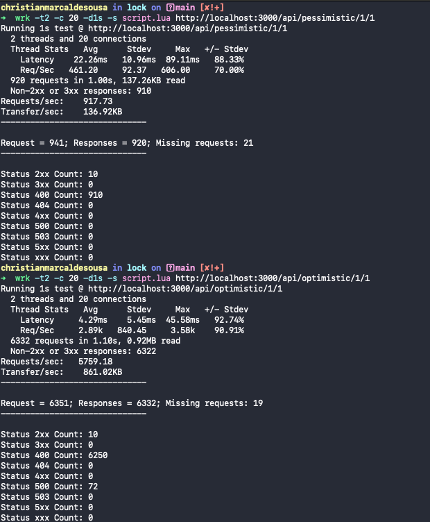

### optimistic-pessimistic-lock

Projeto para demonstrar lock pessimista vs otimista com Java com SpringBoot


```bash
brew instal wrk
```


```bash
docker-compose -p lock up -d
```


```bash
wrk -t2 -c 100 -d1s -s script.lua http://localhost:3000/api/pessimistic/1/1
```

```bash
wrk -t2 -c 100 -d1s -s script.lua http://localhost:3000/api/optimistic/1/1 
```


<p>
  
</p>

